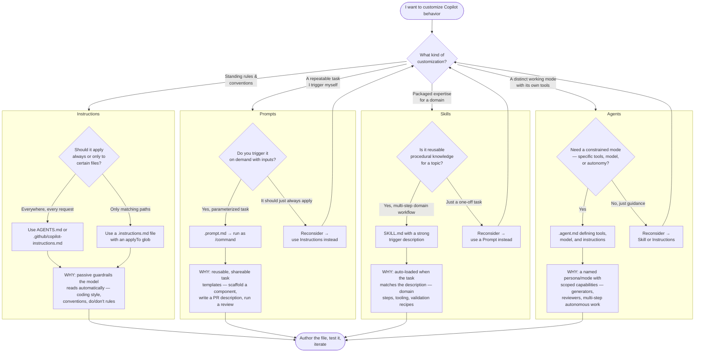
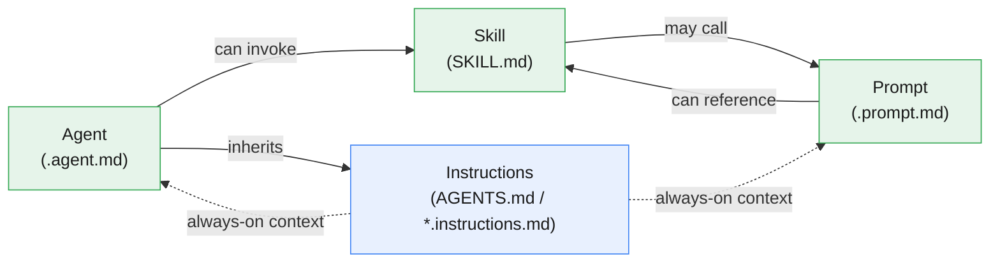

# Choosing a Copilot Configuration Point

A decision guide for **when**, **why**, and **how** to use each Copilot customization
type: **Instructions**, **Prompts**, **Skills**, and **Agents**.

---

## TL;DR — What each one is for

| Type | File(s) | Mental model | Invoked |
|---|---|---|---|
| **Instructions** | `*.instructions.md`, `copilot-instructions.md`, `AGENTS.md` | "Rules that are always true" | Automatically (passive context) |
| **Prompts** | `*.prompt.md` | "A saved task I run on demand" | Manually (slash command `/name`) |
| **Skills** | `SKILL.md` | "Domain know-how loaded when relevant" | Automatically (description match) |
| **Agents** | `*.agent.md` | "A specialized mode with its own tools/model" | Manually (pick the agent) |

---

## Decision flowchart

---

## How they relate

- **Instructions** are passive and always-on; everything else inherits them.
- **Prompts** and **Agents** are user-triggered.
- **Skills** load automatically when a task matches their description.

---

## Quick chooser

- **"It should always be true."** → Instructions
- **"I'll run it when I need it, sometimes with inputs."** → Prompt
- **"It's reusable expertise that should kick in when relevant."** → Skill
- **"I need a dedicated mode with specific tools/model/autonomy."** → Agent
